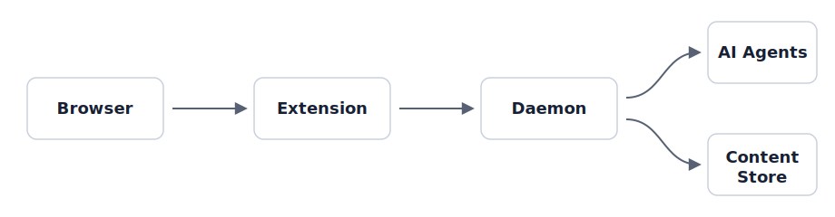

<h1 align="center">WebLayer</h1>

<strong>Control the web you consume.</strong>

WebLayer helps you take sovereignty over the web you consume. It sends page content from your browser to a local daemon, where your own rules and AI agents can learn from your feedback, hide what you do not want to see, and keep relevant browsing data under your control.

  

## Supported Sites

### X.com

WebLayer currently supports X.com posts, adding a local dislike control so you can hide posts and teach the daemon what you do not want to see.

  

