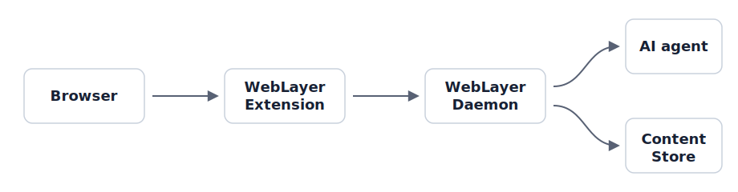

# WebLayer

WebLayer helps you take sovereignty over the web you consume. It sends page
content from your browser to a local daemon, where your own rules and AI agents
can learn from your feedback, hide what you do not want to see, and keep
relevant browsing data under your control.

## What It Includes

- A Chrome extension that captures bounded DOM region snapshots from supported
  sites.
- A local `weblayer` binary that can run as the daemon or as a CLI client.
- Site-scoped local storage for captured content, feedback, annotations, and
  rules.
- Rule management commands and API endpoints for shaping filtering behavior.

## Supported Sites

WebLayer currently supports X.com posts. It adds a local dislike control so you
can hide posts and teach the daemon what you do not want to see.

## Next Steps

- [Install WebLayer](installation.md)
- [Run the local daemon](local-daemon.md)
- [Use the CLI](cli.md)
- [Load the Chrome extension](chrome-extension.md)
- [Manage rules](rules.md)
